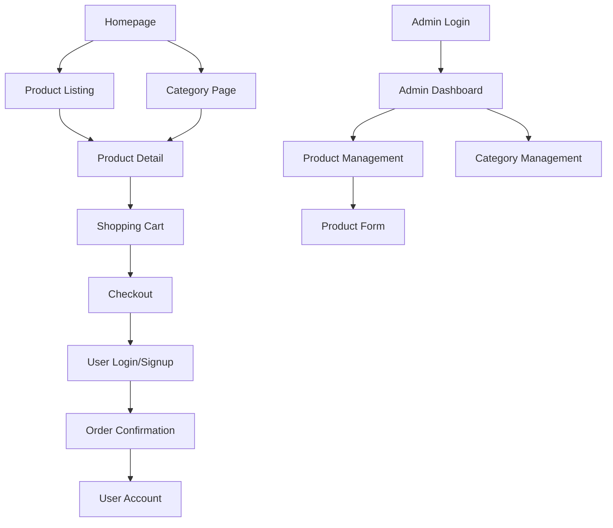

# Camera World E-commerce Platform - Product Requirements Document

## 1. Product Overview

Camera World is a premier, responsive e-commerce platform for new and secondhand camera equipment, built on Firebase stack (Authentication, Firestore, Storage). The platform provides a secure, scalable administrative control panel for store owners and an intuitive shopping experience for customers.

The platform solves the challenge of managing complex camera equipment inventory while providing customers with detailed product information, specialist contact, and seamless purchasing experience. Target market includes photography enthusiasts, professionals, and camera equipment retailers.

## 2. Core Features

### 2.1 User Roles

| Role | Registration Method | Core Permissions |
|------|---------------------|------------------|
| Admin | Direct Firebase Auth setup | Full access to admin panel, product management, order management |
| Customer | Email registration during checkout | Browse products, manage cart, place orders, view order history |

### 2.2 Feature Module

Our Camera World platform consists of the following main pages:

1. **Admin Login Page**: Firebase authentication, role verification
2. **Admin Dashboard**: Welcome screen, statistics overview, navigation hub
3. **Product Management**: Product listing table, create/edit forms, image upload
4. **Category Management**: Category listing, add/delete functionality
5. **Homepage**: Hero section, category showcase, featured products
6. **Product Listing Page**: Product grid, advanced filtering, sorting
7. **Product Detail Page**: Image gallery, detailed information, add to cart
8. **Search Results Page**: Global search functionality, filtered results
9. **Shopping Cart**: Cart management, quantity updates, checkout initiation
10. **Checkout Page**: User authentication, shipping details, payment processing
11. **User Account**: Order history, profile management, address book

### 2.3 Page Details

| Page Name | Module Name | Feature Description |
|-----------|-------------|---------------------|
| Admin Login | Authentication | Firebase Auth integration, role-based access control, error handling |
| Admin Dashboard | Overview | Welcome message, statistics cards (products, orders, revenue), navigation sidebar |
| Product Management | Product Table | Paginated product listing, search functionality, edit/delete actions |
| Product Management | Product Form | Create/edit products, image upload with preview, category dropdown, validation |
| Category Management | Category List | Display categories, add new category, delete with product dependency check |
| Homepage | Hero Section | Banner carousel, featured promotions display |
| Homepage | Category Showcase | Dynamic category grid from Firestore, navigation to category pages |
| Homepage | Featured Products | Curated product display using ProductCard component |
| Product Listing | Filter Panel | Category checkboxes, condition toggle, price range slider |
| Product Listing | Product Grid | Responsive grid layout, ProductCard components, sorting dropdown |
| Product Detail | Image Gallery | Main image display, thumbnail navigation, zoom functionality |
| Product Detail | Product Info | Name, price, stock status, specialist contact, add to cart button |
| Product Detail | Detailed Info | Tabbed description and features, condition display for secondhand |
| Search Results | Search Interface | Global search bar, query processing, filtered results display |
| Shopping Cart | Cart Management | Item display, quantity updates, remove items, total calculation |
| Checkout | User Auth | Login/signup integration, guest checkout option |
| Checkout | Order Form | Shipping address, payment method selection, order summary |
| User Account | Profile | Personal information management, address book |
| User Account | Order History | Past orders display, order status tracking |

## 3. Core Process

**Admin Flow:**
1. Admin logs in through Firebase Auth with role verification
2. Access admin dashboard with navigation to product/category management
3. Create/edit products with image upload to Firebase Storage
4. Manage categories with dependency checking before deletion
5. View orders and manage inventory through real-time Firestore updates

**Customer Flow:**
1. Browse homepage with featured products and categories
2. Navigate to product listings with filtering and sorting options
3. View detailed product information with specialist contact
4. Add products to cart (stored locally until checkout)
5. Proceed to checkout with authentication requirement
6. Complete order placement with Firestore storage
7. Access account for order history and profile management

## 4. User Interface Design

### 4.1 Design Style

- **Primary Colors**: Professional blue (#2563eb) and clean white (#ffffff)
- **Secondary Colors**: Gray scale (#f8fafc, #64748b) for backgrounds and text
- **Button Style**: Rounded corners (8px), hover effects, loading states
- **Font**: Inter or system fonts, 16px base size, responsive scaling
- **Layout Style**: Card-based design, clean spacing, mobile-first approach
- **Icons**: Heroicons or similar modern icon set, consistent sizing

### 4.2 Page Design Overview

| Page Name | Module Name | UI Elements |
|-----------|-------------|-------------|
| Admin Login | Login Form | Centered card layout, blue primary button, error message display |
| Admin Dashboard | Sidebar | Fixed left sidebar on desktop, hamburger menu on mobile, blue accent |
| Admin Dashboard | Stats Cards | Grid layout, white cards with shadow, icon + number + label |
| Product Management | Data Table | Responsive table to card transformation, search bar, pagination |
| Product Form | Image Upload | Drag-drop area, thumbnail previews, progress bars, delete buttons |
| Homepage | Hero Section | Full-width banner, overlay text, call-to-action buttons |
| Product Listing | Filter Panel | Collapsible on mobile, checkbox groups, range sliders |
| Product Card | Card Layout | Image, title, price, condition badge, hover effects |
| Product Detail | Gallery | Large main image, thumbnail strip, zoom on hover |
| Shopping Cart | Cart Items | Product rows, quantity controls, remove buttons, total summary |
| Checkout | Form Layout | Multi-step process, progress indicator, validation feedback |

### 4.3 Responsiveness

The platform is mobile-first with desktop enhancement. Touch interactions are optimized for mobile devices. Breakpoints: mobile (320px+), tablet (768px+), desktop (1024px+). All components adapt fluidly between screen sizes with appropriate touch targets and spacing.