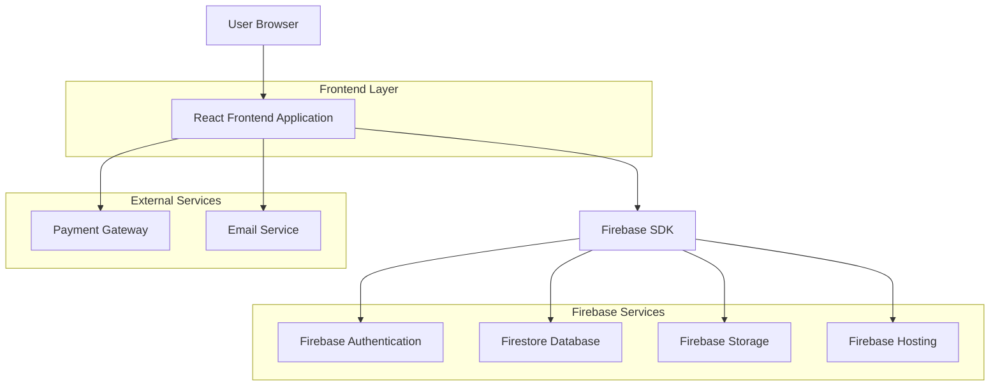
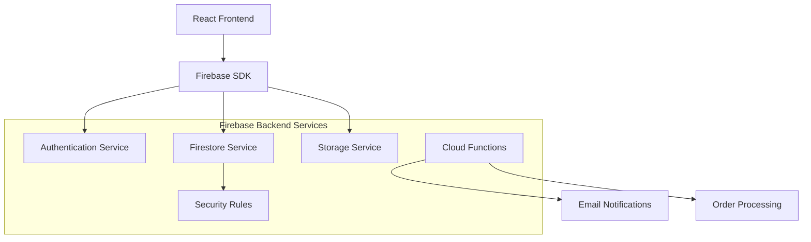
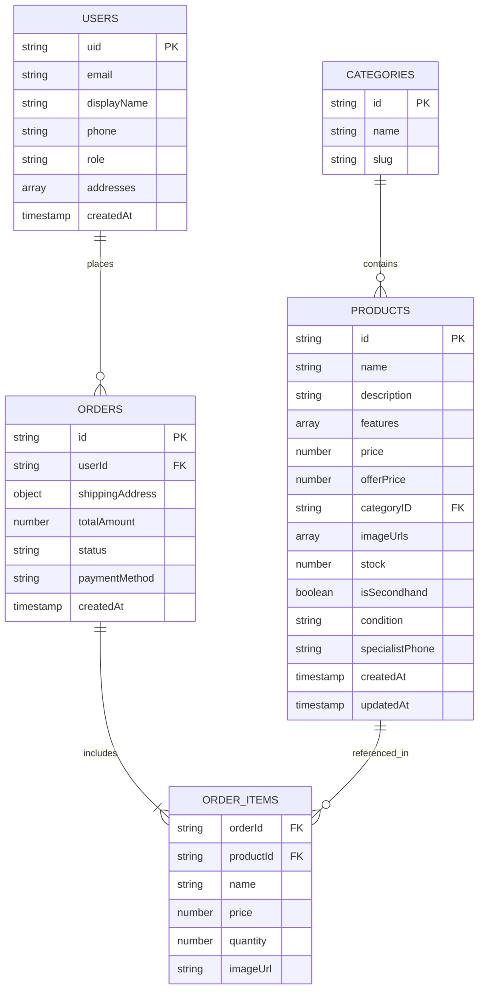

# Camera World E-commerce Platform - Technical Architecture Document

## 1. Architecture Design



## 2. Technology Description

* **Frontend**: React\@18 + TypeScript + Tailwind CSS\@3 + Vite

* **Backend**: Firebase (Serverless)

* **Database**: Firestore (NoSQL)

* **Authentication**: Firebase Authentication

* **Storage**: Firebase Storage

* **Hosting**: Firebase Hosting

* **State Management**: React Context + useReducer

* **Routing**: React Router\@6

* **Form Handling**: React Hook Form

* **UI Components**: Headless UI + Custom Components

## 3. Route Definitions

| Route                    | Purpose                                                       |
| ------------------------ | ------------------------------------------------------------- |
| /                        | Homepage with hero section, categories, and featured products |
| /products                | All products listing with filtering and sorting               |
| /category/:slug          | Category-specific product listing                             |
| /product/:productId      | Individual product detail page                                |
| /search                  | Search results page with query parameter                      |
| /special-offers          | Products with offer prices                                    |
| /secondhand              | Secondhand products only                                      |
| /cart                    | Shopping cart management                                      |
| /checkout                | Checkout process with authentication                          |
| /account                 | User account dashboard                                        |
| /account/orders          | Order history                                                 |
| /account/profile         | Profile management                                            |
| /admin/login             | Admin authentication                                          |
| /admin/dashboard         | Admin overview                                                |
| /admin/products          | Product management table                                      |
| /admin/products/new      | Create new product                                            |
| /admin/products/edit/:id | Edit existing product                                         |
| /admin/categories        | Category management                                           |

## 4. API Definitions (Firebase Integration)

### 4.1 Authentication APIs

**User Registration**

```typescript
interface UserRegistration {
  email: string;
  password: string;
  displayName: string;
  phone?: string;
}

interface AuthResponse {
  user: User;
  token: string;
}
```

**Admin Role Verification**

```typescript
interface UserRole {
  uid: string;
  email: string;
  role: 'admin' | 'customer';
  displayName: string;
}
```

### 4.2 Product APIs

**Product Data Structure**

```typescript
interface Product {
  id: string;
  name: string;
  description: string;
  features: string[];
  price: number;
  offerPrice?: number;
  categoryID: string;
  imageUrls: string[];
  stock: number;
  isSecondhand: boolean;
  condition?: string;
  specialistPhone: string;
  createdAt: Timestamp;
  updatedAt: Timestamp;
}
```

**Category Data Structure**

```typescript
interface Category {
  id: string;
  name: string;
  slug: string;
}
```

### 4.3 Order APIs

**Order Data Structure**

```typescript
interface Order {
  id: string;
  userId: string;
  products: OrderItem[];
  shippingAddress: Address;
  totalAmount: number;
  status: 'pending' | 'confirmed' | 'shipped' | 'delivered' | 'cancelled';
  paymentMethod: string;
  createdAt: Timestamp;
}

interface OrderItem {
  productId: string;
  name: string;
  price: number;
  quantity: number;
  imageUrl: string;
}

interface Address {
  street: string;
  city: string;
  state: string;
  zipCode: string;
  country: string;
}
```

## 5. Server Architecture Diagram



## 6. Data Model

### 6.1 Data Model Definition



### 6.2 Firestore Collections Structure

**Users Collection**

```javascript
// Collection: users
// Document ID: Firebase Auth UID
{
  email: "admin@cameraworld.com",
  displayName: "John Admin",
  phone: "+1234567890",
  role: "admin", // "admin" | "customer"
  addresses: [
    {
      street: "123 Main St",
      city: "New York",
      state: "NY",
      zipCode: "10001",
      country: "USA"
    }
  ],
  createdAt: serverTimestamp()
}
```

**Categories Collection**

```javascript
// Collection: categories
// Document ID: Auto-generated
{
  name: "DSLR Cameras",
  slug: "dslr-cameras"
}
```

**Products Collection**

```javascript
// Collection: products
// Document ID: Auto-generated
{
  name: "Canon EOS R5",
  description: "Professional mirrorless camera with 45MP sensor",
  features: [
    "45MP Full-Frame CMOS Sensor",
    "8K Video Recording",
    "In-Body Image Stabilization"
  ],
  price: 3899.99,
  offerPrice: 3499.99, // Optional
  categoryID: "category_doc_id",
  imageUrls: [
    "https://storage.googleapis.com/bucket/image1.jpg",
    "https://storage.googleapis.com/bucket/image2.jpg"
  ],
  stock: 15,
  isSecondhand: false,
  condition: null, // Required if isSecondhand is true
  specialistPhone: "+1-800-CAMERA",
  createdAt: serverTimestamp(),
  updatedAt: serverTimestamp()
}
```

**Orders Collection**

```javascript
// Collection: orders
// Document ID: Auto-generated
{
  userId: "firebase_auth_uid",
  products: [
    {
      productId: "product_doc_id",
      name: "Canon EOS R5",
      price: 3499.99,
      quantity: 1,
      imageUrl: "https://storage.googleapis.com/bucket/image1.jpg"
    }
  ],
  shippingAddress: {
    street: "456 Oak Ave",
    city: "Los Angeles",
    state: "CA",
    zipCode: "90210",
    country: "USA"
  },
  totalAmount: 3499.99,
  status: "pending",
  paymentMethod: "credit_card",
  createdAt: serverTimestamp()
}
```

### 6.3 Firestore Security Rules

```javascript
rules_version = '2';
service cloud.firestore {
  match /databases/{database}/documents {
    // Users can read/write their own user document
    match /users/{userId} {
      allow read, write: if request.auth != null && request.auth.uid == userId;
      // Admins can read all user documents
      allow read: if request.auth != null && 
        exists(/databases/$(database)/documents/users/$(request.auth.uid)) &&
        get(/databases/$(database)/documents/users/$(request.auth.uid)).data.role == 'admin';
    }
    
    // Products - public read, admin write
    match /products/{productId} {
      allow read: if true; // Public read access
      allow write: if request.auth != null && 
        exists(/databases/$(database)/documents/users/$(request.auth.uid)) &&
        get(/databases/$(database)/documents/users/$(request.auth.uid)).data.role == 'admin';
    }
    
    // Categories - public read, admin write
    match /categories/{categoryId} {
      allow read: if true; // Public read access
      allow write: if request.auth != null && 
        exists(/databases/$(database)/documents/users/$(request.auth.uid)) &&
        get(/databases/$(database)/documents/users/$(request.auth.uid)).data.role == 'admin';
    }
    
    // Orders - users can read/write their own orders, admins can read all
    match /orders/{orderId} {
      allow read, write: if request.auth != null && 
        request.auth.uid == resource.data.userId;
      allow read: if request.auth != null && 
        exists(/databases/$(database)/documents/users/$(request.auth.uid)) &&
        get(/databases/$(database)/documents/users/$(request.auth.uid)).data.role == 'admin';
    }
  }
}
```

### 6.4 Firebase Storage Rules

```javascript
rules_version = '2';
service firebase.storage {
  match /b/{bucket}/o {
    // Product images - public read, admin write
    match /products/{allPaths=**} {
      allow read: if true;
      allow write: if request.auth != null && 
        firestore.exists(/databases/(default)/documents/users/$(request.auth.uid)) &&
        firestore.get(/databases/(default)/documents/users/$(request.auth.uid)).data.role == 'admin';
    }
  }
}
```

### 6.5 Firestore Indexes

```javascript
// Required composite indexes for efficient querying
[
  {
    "collectionGroup": "products",
    "queryScope": "COLLECTION",
    "fields": [
      {"fieldPath": "categoryID", "order": "ASCENDING"},
      {"fieldPath": "price", "order": "ASCENDING"}
    ]
  },
  {
    "collectionGroup": "products",
    "queryScope": "COLLECTION",
    "fields": [
      {"fieldPath": "isSecondhand", "order": "ASCENDING"},
      {"fieldPath": "createdAt", "order": "DESCENDING"}
    ]
  },
  {
    "collectionGroup": "orders",
    "queryScope": "COLLECTION",
    "fields": [
      {"fieldPath": "userId", "order": "ASCENDING"},
      {"fieldPath": "createdAt", "order": "DESCENDING"}
    ]
  }
]
```

