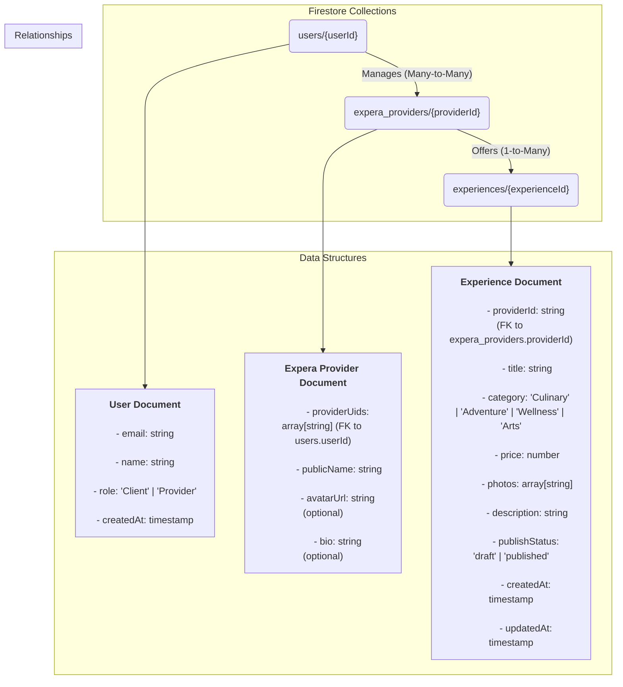

# Firestore Schema Design

This document outlines the Firestore database schema for the application, designed for scalability, security, and efficient querying.

## Schema Diagram

## Collections

### `users`

*   **Document ID:** `userId` (Firebase Auth UID)
*   **Description:** Stores essential user information linked to their authentication account.

| Field | Type | Description |
| :--- | :--- | :--- |
| `email` | `string` | User's email address. |
| `name` | `string` | User's display name. |
| `role` | `string` | User's role (`Client` or `Provider`). |
| `createdAt` | `timestamp` | Server-generated timestamp of account creation. |

### `expera_providers`

*   **Document ID:** Auto-generated unique ID
*   **Description:** Stores public-facing information for experience providers (business entities).

| Field | Type | Description |
| :--- | :--- | :--- |
| `providerUids` | `array` | An array of `userId`s for users who can manage this entity. |
| `publicName` | `string` | The public name of the provider (e.g., "Mountain Ascent Guides"). |
| `avatarUrl` | `string` | (Optional) URL for the provider's avatar. |
| `bio` | `string` | (Optional) A short biography for the provider. |

### `experiences`

*   **Document ID:** Auto-generated unique ID
*   **Description:** Stores details for each experience offered by a provider.

| Field | Type | Description |
| :--- | :--- | :--- |
| `providerId` | `string` | The ID of the `expera_providers` document this experience belongs to. |
| `title` | `string` | The title of the experience. |
| `category` | `string` | The category of the experience (`Culinary`, `Adventure`, etc.). |
| `price` | `number` | The price per person for the experience. |
| `photos` | `array` | An array of URLs for the experience's photos. |
| `description` | `string` | A detailed description of the experience. |
| `publishStatus` | `string` | The status of the experience (`draft` or `published`). |
| `createdAt` | `timestamp` | Server-generated timestamp of creation. |
| `updatedAt` | `timestamp` | Server-generated timestamp of the last update. |
